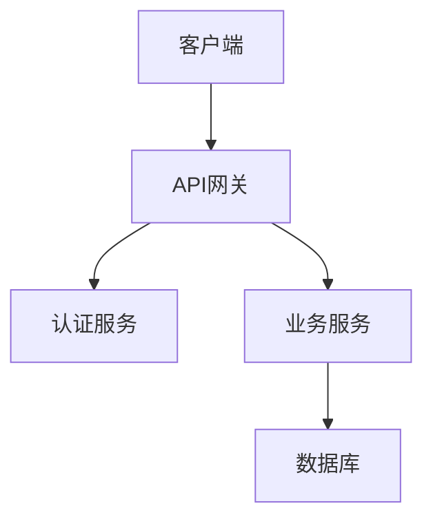

# Markdown to PPT Conversion Examples

## Example 1: Business Presentation

### Input Markdown
```markdown
# 2024年度技术架构演进汇报
## 团队与技术发展概述

### 核心数据指标
- 系统可用性：99.95%
- 响应时间：平均120ms
- 用户增长：+45% 同比增长

### 技术栈升级
1. 前端架构重构
   - React 18 + TypeScript
   - 微前端架构实施
   - 性能优化35%

2. 后端服务升级
   - Node.js → Go语言迁移
   - 微服务架构完善
   - 数据库性能优化
```

### Generated Output
- Cover slide with title and subtitle
- Content slide with data metrics highlighted in orange
- Process flow slide for technology upgrades
- Professional styling with specified color scheme

---

## Example 2: Data Analysis Presentation

### Input Markdown
```markdown
# 市场分析报告
## 用户行为数据分析

| 指标 | Q1 | Q2 | Q3 | 增长率 |
|------|----|----|----|--------|
| 日活用户 | 50K | 65K | 78K | +56% |
| 转化率 | 2.1% | 2.8% | 3.2% | +52% |
| 客单价 | ¥280 | ¥320 | ¥350 | +25% |

## 关键发现
**移动端用户占比达到78%**，较上季度增长12个百分点。
**夜间活跃度**显著提升，晚上8-10点成为高峰期。
```

### Generated Output
- Professional data table with alternating row colors
- Key findings highlighted with orange emphasis
- Chart-ready layout for data visualization
- Responsive grid for metric cards

---

## Example 3: Technical Documentation

### Input Markdown
```markdown
# API架构设计文档
## 系统架构概览



### 核心组件
- **API网关**：统一入口，限流熔断
- **认证服务**：JWT令牌，OAuth2.0
- **业务服务**：微服务架构，独立部署
```

### Generated Output
- Technical diagram integration
- Code block with syntax highlighting
- Component list with professional styling
- Architecture overview slide

---

## Example 4: Comparison Analysis

### Input Markdown
```markdown
# 技术方案对比
## 微服务 vs 单体架构

### 微服务优势
- 独立部署和扩展
- 技术栈灵活性
- 故障隔离性好
- 团队自治性强

### 单体架构优势
- 开发调试简单
- 部署运维容易
- 性能调优方便
- 数据一致性保障
```

### Generated Output
- Two-column comparison layout
- Color-coded pros and cons
- Professional contrast styling
- Balanced presentation of both options

---

## Example 5: Process Documentation

### Input Markdown
```markdown
# 项目开发流程
## 敏捷开发实施步骤

1. **需求分析阶段**
   - 用户故事编写
   - 优先级排序
   - 工作量评估

2. **开发实施阶段**
   - 任务分解分配
   - 日常代码提交
   - 持续集成检查

3. **测试验证阶段**
   - 单元测试覆盖
   - 集成测试验证
   - 用户验收测试

4. **部署上线阶段**
   - 预发布环境验证
   - 生产环境部署
   - 监控告警配置
```

### Generated Output
- Process flow visualization
- Numbered steps with orange circles
- Detailed sub-points for each phase
- Professional process documentation layout

---

## Advanced Features Examples

### Interactive Elements
```markdown
# 演示互动功能
## 导航和控制

- **键盘导航**：左右箭头键切换幻灯片
- **下载功能**：按"D"键下载当前幻灯片
- **进度显示**：底部显示当前页码和总页数
- **响应式设计**：适配不同屏幕尺寸
```

### Color Scheme Application
```markdown
# 配色方案展示
## 专业色彩应用

### 主色调
- **橙色** (#F85d42)：强调和突出显示
- **深蓝色** (#556EE6)：主要标题和链接
- **黑色** (#000000)：标题栏背景

### 辅助色彩
- **绿色** (#34c38f)：正面数据和成功状态
- **浅蓝色** (#50a5f1)：信息性内容
- **黄色** (#f1b44c)：警告和注意事项
```

### Complex Layout Example
```markdown
# 复杂布局演示
## 多元素组合展示

| 模块 | 状态 | 进度 | 负责人 |
|------|------|------|--------|
| 用户系统 | ✅ 完成 | 100% | 张三 |
| 支付系统 | 🔄 进行中 | 75% | 李四 |
| 数据分析 | 📋 计划中 | 25% | 王五 |

> "优质的架构设计是系统成功的关键"
> 
> —— 技术总监

### 下一步计划
1. **Q1**：完成核心功能开发
2. **Q2**：进行系统集成测试
3. **Q3**：用户验收和上线准备
```

### Output Quality Standards
All generated presentations include:
- ✅ Fixed 960x540px slide dimensions
- ✅ Professional McKinsey/BCG-level design
- ✅ Consistent color scheme application
- ✅ High-quality image download functionality
- ✅ Smooth navigation and transitions
- ✅ Responsive controls and interface
- ✅ Accessibility-compliant contrast ratios
- ✅ Cross-browser compatibility

### Usage Tips
1. **Structure your content** with clear headers and sections
2. **Use tables** for data-heavy content
3. **Leverage lists** for sequential information
4. **Include images** with descriptive alt text
5. **Apply emphasis** strategically with bold text
6. **Consider slide flow** when organizing sections
7. **Test the download** functionality for important presentations